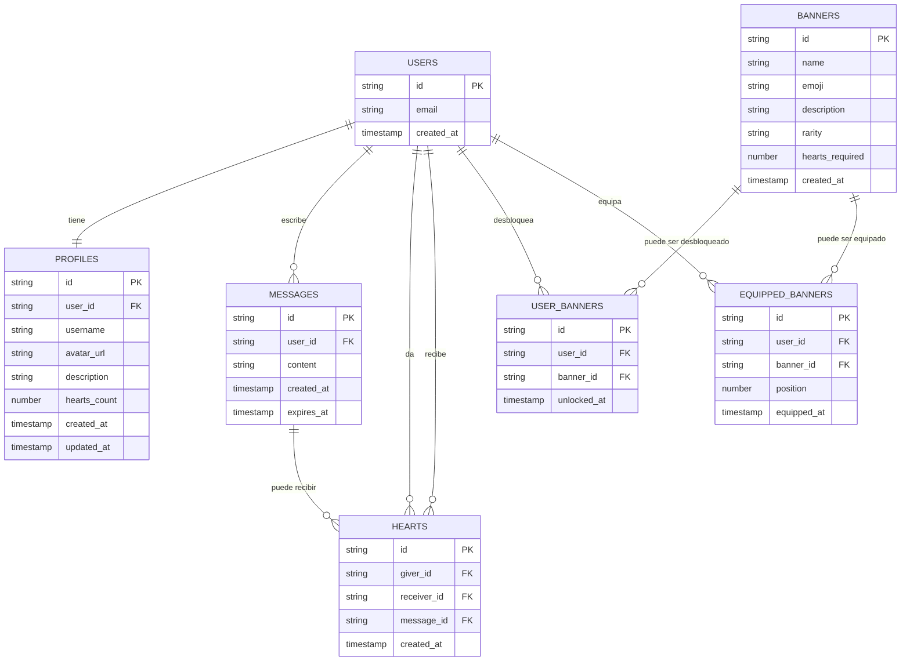

# Modelo Entidad-Relación y Flujo de Trabajo
## Proyecto H Chat

### 1. Diagrama Entidad-Relación

### 2. Flujo de Trabajo Completo

#### 2.1 Registro de Usuario
1. **Inicio**: Usuario accede a la aplicación
2. **Registro**: Usuario completa formulario con email y contraseña
3. **Validación**: Sistema valida datos de entrada
4. **Creación de cuenta**: Supabase Auth crea usuario
5. **Creación de perfil**: Sistema crea perfil automáticamente
6. **Redirección**: Usuario es dirigido al chat

#### 2.2 Proceso de Autenticación
1. **Login**: Usuario ingresa credenciales
2. **Verificación**: Supabase Auth verifica identidad
3. **Sesión**: Se establece sesión segura
4. **Carga de datos**: Se cargan perfil y banners equipados

#### 2.3 Sistema de Chat
1. **Envío de mensaje**: Usuario escribe y envía mensaje
2. **Validación**: Sistema valida contenido
3. **Almacenamiento**: Mensaje se guarda en base de datos
4. **Broadcast**: Mensaje se envía en tiempo real via WebSocket
5. **Visualización**: Todos los usuarios conectados ven el mensaje

#### 2.4 Sistema de Corazones
1. **Interacción**: Usuario hace clic en botón de corazón
2. **Validación**: Sistema verifica que no sea autocorazón ni duplicado
3. **Registro**: Se crea entrada en tabla hearts
4. **Actualización**: Se incrementa hearts_count del receptor
5. **Notificación**: Usuario receptor recibe feedback

#### 2.5 Sistema de Banners
1. **Verificación**: Sistema monitorea hearts_count del usuario
2. **Elegibilidad**: Se verifica si cumple requisitos para nuevos banners
3. **Desbloqueo**: Banner se añade a user_banners
4. **Notificación**: Usuario recibe notificación de desbloqueo
5. **Equipamiento**: Usuario puede equipar banner desde configuración

### 3. Relaciones y Cardinalidades

| Entidad A | Relación | Entidad B | Cardinalidad |
|-----------|----------|-----------|--------------|
| Users | tiene | Profiles | 1:1 |
| Users | escribe | Messages | 1:N |
| Users | da | Hearts | 1:N |
| Users | recibe | Hearts | 1:N |
| Users | desbloquea | Banners | N:M |
| Users | equipa | Banners | N:M |
| Messages | recibe | Hearts | 1:N |

### 4. Restricciones de Integridad

#### 4.1 Restricciones de Dominio
- `hearts_count` debe ser ≥ 0
- `position` en equipped_banners debe ser 1-3
- `rarity` debe ser: common, rare, epic, legendary

#### 4.2 Restricciones de Integridad Referencial
- Todos los FK deben referenciar entidades existentes
- No se puede eliminar usuario con mensajes o corazones asociados
- Banner debe existir antes de ser desbloqueado o equipado

#### 4.3 Restricciones Específicas del Negocio
- Usuario no puede darse corazón a sí mismo
- Solo un corazón por usuario por receptor
- Máximo 3 banners equipados simultáneamente
- Solo se pueden equipar banners desbloqueados

### 5. Índices y Optimización

#### 5.1 Índices Primarios
- Todas las tablas tienen índice en `id` (clave primaria)

#### 5.2 Índices Secundarios Recomendados
- `messages.user_id` (consultas de mensajes por usuario)
- `hearts.receiver_id` (conteo de corazones recibidos)
- `hearts.giver_id, receiver_id` (prevención duplicados)
- `user_banners.user_id` (banners por usuario)
- `equipped_banners.user_id` (banners equipados)