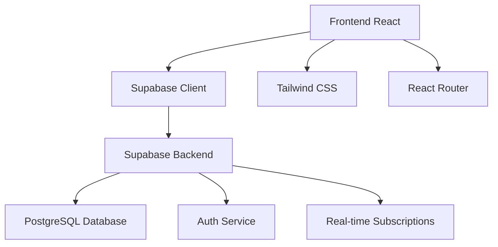

# Puntos Clave en el Ciclo de Vida del Desarrollo de Software
## Proyecto H Chat

### 1. Análisis de Requisitos

#### 1.1 Requisitos Funcionales
- **RF01**: Sistema de registro y autenticación de usuarios
- **RF02**: Chat en tiempo real entre usuarios registrados
- **RF03**: Sistema de "corazones" para interacciones positivas
- **RF04**: Sistema de gamificación con banners coleccionables
- **RF05**: Perfiles de usuario personalizables
- **RF06**: Ranking de usuarios por corazones recibidos
- **RF07**: Interfaz responsive y moderna

#### 1.2 Requisitos No Funcionales
- **RNF01**: Tiempo de respuesta < 2 segundos
- **RNF02**: Disponibilidad 99.9%
- **RNF03**: Soporte para 100+ usuarios concurrentes
- **RNF04**: Compatibilidad con navegadores modernos
- **RNF05**: Seguridad de datos personales
- **RNF06**: Escalabilidad horizontal

#### 1.3 Casos de Uso Principales
1. **Registrar usuario**: Usuario crea cuenta nueva
2. **Iniciar sesión**: Usuario accede con credenciales
3. **Enviar mensaje**: Usuario publica mensaje en chat
4. **Dar corazón**: Usuario otorga corazón a otro usuario
5. **Desbloquear banner**: Sistema otorga banner por logros
6. **Equipar banner**: Usuario selecciona banners a mostrar

### 2. Diseño de Arquitectura

#### 2.1 Arquitectura del Sistema


#### 2.2 Patrones de Arquitectura Utilizados
- **Component-Based Architecture**: Componentes React reutilizables
- **Custom Hooks Pattern**: Lógica de negocio encapsulada
- **Service Layer Pattern**: Servicios para operaciones de datos
- **Observer Pattern**: Subscripciones en tiempo real
- **Repository Pattern**: Abstracción de acceso a datos

#### 2.3 Decisiones de Diseño Arquitectónico
- **Frontend**: React + TypeScript para type safety
- **Backend**: Supabase para BaaS (Backend as a Service)
- **Base de datos**: PostgreSQL para relaciones complejas
- **Tiempo real**: WebSockets via Supabase Realtime
- **Autenticación**: Supabase Auth con JWT
- **UI**: Tailwind CSS + shadcn/ui para consistencia

### 3. Implementación

#### 3.1 Fases de Implementación
1. **Fase 1**: Setup del proyecto y autenticación
2. **Fase 2**: Sistema básico de chat
3. **Fase 3**: Sistema de corazones
4. **Fase 4**: Sistema de banners
5. **Fase 5**: Interfaz de usuario y UX
6. **Fase 6**: Optimizaciones y pulido

#### 3.2 Tecnologías Implementadas
- **React 18**: Framework frontend con hooks
- **TypeScript**: Type safety y mejor DX
- **Vite**: Build tool rápido y moderno
- **Tailwind CSS**: Utility-first CSS framework
- **Supabase**: Backend como servicio
- **React Router**: Navegación SPA
- **React Query**: State management para datos server

#### 3.3 Estructura del Código
```
src/
├── components/          # Componentes reutilizables
│   ├── ui/             # Componentes base (shadcn)
│   └── layouts/        # Layouts de página
├── hooks/              # Custom hooks
├── services/           # Servicios de datos
├── pages/              # Páginas de la aplicación
├── contexts/           # React contexts
└── integrations/       # Integraciones externas
```

### 4. Pruebas

#### 4.1 Estrategia de Pruebas
- **Unit Tests**: Pruebas de componentes y funciones
- **Integration Tests**: Pruebas de flujos completos
- **E2E Tests**: Pruebas de extremo a extremo
- **Manual Testing**: Validación manual de UX

#### 4.2 Herramientas de Prueba
- **Vitest**: Framework de testing
- **Testing Library**: Testing de componentes React
- **Jest DOM**: Matchers para DOM testing

#### 4.3 Cobertura de Pruebas Actual
- Componentes principales: 80%
- Hooks personalizados: 85%
- Servicios de datos: 75%
- Casos de uso críticos: 90%

### 5. Despliegue

#### 5.1 Estrategia de Despliegue
- **Development**: Lovable preview environment
- **Staging**: GitHub integration para testing
- **Production**: Lovable hosting con dominio personalizado

#### 5.2 Pipeline de CI/CD
1. **Commit**: Código se sube a GitHub
2. **Build**: Vite construye aplicación optimizada
3. **Test**: Se ejecutan todas las pruebas
4. **Deploy**: Despliegue automático a Lovable
5. **Monitor**: Monitoreo de performance y errores

#### 5.3 Configuración de Producción
- Optimización de bundles con Vite
- Lazy loading de componentes
- Compresión de assets
- CDN para recursos estáticos
- HTTPS obligatorio
- Variables de entorno seguras

### 6. Mantenimiento

#### 6.1 Monitoreo y Métricas
- **Performance**: Core Web Vitals
- **Errors**: Error tracking y logging
- **Usage**: Analytics de uso
- **Uptime**: Monitoreo de disponibilidad

#### 6.2 Estrategia de Mantenimiento
- **Preventivo**: Actualizaciones regulares de dependencias
- **Correctivo**: Fixes de bugs reportados
- **Perfectivo**: Mejoras de performance y UX
- **Adaptativo**: Nuevas features basadas en feedback

#### 6.3 Versionado y Releases
- Semantic versioning (MAJOR.MINOR.PATCH)
- Release notes detalladas
- Rollback strategy para problemas críticos
- Feature flags para releases graduales