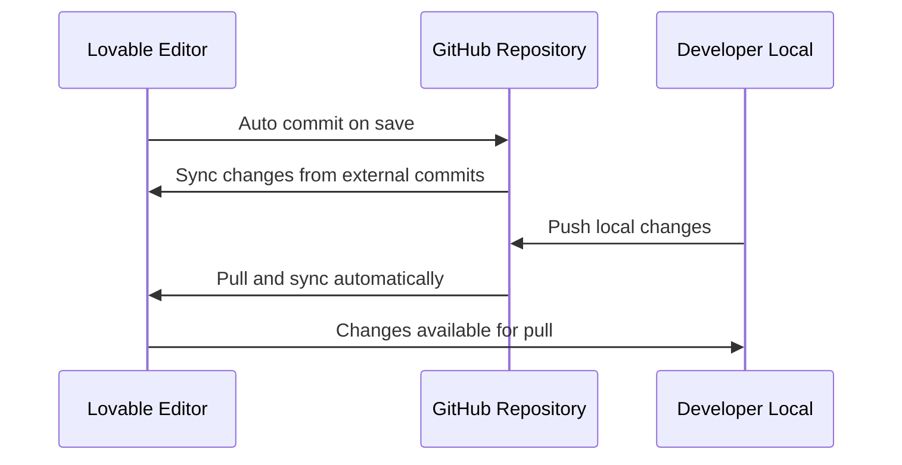

# Control de Versiones
## Proyecto H Chat

### 1. Estrategia de Control de Versiones

#### 1.1 Sistema Utilizado
- **Git**: Sistema de control de versiones distribuido
- **GitHub**: Plataforma de alojamiento y colaboración
- **Lovable Integration**: Sincronización bidireccional automática

#### 1.2 Workflow de Desarrollo
```mermaid
gitgraph
    commit id: "Initial setup"
    branch feature/auth
    commit id: "Add authentication"
    commit id: "Fix login validation"
    checkout main
    merge feature/auth
    branch feature/chat
    commit id: "Basic chat functionality"
    commit id: "Add real-time updates"
    checkout main
    merge feature/chat
    branch feature/hearts
    commit id: "Heart system implementation"
    commit id: "Heart validation logic"
    checkout main
    merge feature/hearts
    commit id: "Release v1.0"
```

### 2. Estructura de Branches

#### 2.1 Branch Principal
- **main**: Código estable y desplegable
- Política: Solo merges de features completadas y probadas
- Protección: Requiere review antes de merge

#### 2.2 Feature Branches
```bash
feature/authentication     # Sistema de autenticación
feature/realtime-chat     # Chat en tiempo real  
feature/heart-system      # Sistema de corazones
feature/banner-system     # Sistema de banners
feature/ui-improvements   # Mejoras de interfaz
hotfix/login-bug         # Correción urgente de login
```

#### 2.3 Convención de Nombres
```bash
# Formato: tipo/descripcion-breve
feature/nueva-funcionalidad
bugfix/correccion-error
hotfix/error-critico
refactor/mejora-codigo
docs/actualizacion-documentacion
```

### 3. Historial de Commits Significativos

#### 3.1 Commits de Configuración Inicial
```bash
commit a1b2c3d - Initial project setup with Vite + React + TypeScript
commit b2c3d4e - Configure Tailwind CSS and design system  
commit c3d4e5f - Setup Supabase integration and types
commit d4e5f6g - Configure routing with React Router
```

#### 3.2 Commits de Funcionalidad Principal
```bash
# Sistema de Autenticación
commit e5f6g7h - Add user registration and login forms
commit f6g7h8i - Implement protected routes and auth context
commit g7h8i9j - Add profile creation and management

# Sistema de Chat  
commit h8i9j0k - Implement basic message sending and display
commit i9j0k1l - Add real-time message subscriptions
commit j0k1l2m - Add message validation and error handling
commit k1l2m3n - Implement message deletion functionality

# Sistema de Corazones
commit l2m3n4o - Create heart service and database schema
commit m3n4o5p - Add heart giving functionality to messages
commit n4o5p6q - Implement heart count tracking and updates
commit o5p6q7r - Add duplicate heart prevention logic

# Sistema de Banners
commit p6q7r8s - Design banner system architecture
commit q7r8s9t - Implement banner unlocking logic
commit r8s9t0u - Add banner equipping functionality  
commit s9t0u1v - Create banner management interface
```

#### 3.3 Commits de Refactoring y Mejoras
```bash
commit t0u1v2w - Refactor chat logic into custom hook
commit u1v2w3x - Extract message service layer
commit v2w3x4y - Improve error handling and user feedback
commit w3x4y5z - Optimize component re-renders with React.memo
commit x4y5z6a - Add comprehensive error boundaries
```

### 4. Mensajes de Commit Estructurados

#### 4.1 Convención Utilizada
Formato basado en [Conventional Commits](https://www.conventionalcommits.org/):

```bash
tipo(alcance): descripción corta

[cuerpo opcional del commit]

[footer opcional]
```

#### 4.2 Tipos de Commit
- **feat**: Nueva funcionalidad
- **fix**: Corrección de bug
- **docs**: Documentación
- **style**: Formateo, sin cambios de lógica
- **refactor**: Refactoring sin cambios funcionales
- **test**: Añadir o modificar tests
- **chore**: Tareas de mantenimiento

#### 4.3 Ejemplos Reales
```bash
feat(auth): add user registration with email validation

- Implement registration form with proper validation
- Add password strength requirements  
- Integrate with Supabase Auth service
- Add error handling for duplicate emails

Closes #123

---

fix(chat): prevent empty messages from being sent

- Add client-side validation for message content
- Trim whitespace before sending
- Display error toast for empty messages
- Update send button state accordingly

---

refactor(components): extract reusable UserAvatar component  

- Create shared UserAvatar component
- Add size variants (sm, md, lg)
- Include fallback for missing avatar URLs
- Update all usage locations

---

docs: add comprehensive API documentation

- Document all service methods
- Add JSDoc comments for public interfaces
- Create usage examples for custom hooks
- Update README with development guidelines
```

### 5. Gestión de Releases y Tags

#### 5.1 Versionado Semántico
Siguiendo [Semantic Versioning](https://semver.org/):
```
MAJOR.MINOR.PATCH
```

- **MAJOR**: Cambios incompatibles en la API
- **MINOR**: Nuevas funcionalidades compatibles
- **PATCH**: Correcciones de bugs compatibles

#### 5.2 Historial de Releases
```bash
v1.0.0 - Initial release
- Sistema completo de autenticación
- Chat en tiempo real funcional  
- Sistema básico de corazones
- Interfaz responsive inicial

v1.1.0 - Banner System Update
- Sistema completo de banners
- Gamificación con desbloqueos
- Configuración de banners equipados
- Mejoras en UI/UX

v1.1.1 - Bug fixes and improvements  
- Fix: Duplicate heart prevention
- Fix: Message validation edge cases
- Improvement: Loading states
- Improvement: Error messages

v1.2.0 - Performance and Features
- Feature: Message deletion
- Feature: Chat clearing for admins
- Performance: Optimized re-renders
- Feature: Dark mode support
```

#### 5.3 Comandos de Tagging
```bash
# Crear tag anotado
git tag -a v1.0.0 -m "Initial release with core functionality"

# Listar tags
git tag -l

# Push tags al repositorio
git push origin --tags

# Checkout a tag específico
git checkout v1.0.0
```

### 6. Integración con Lovable

#### 6.1 Sincronización Bidireccional


#### 6.2 Workflow de Desarrollo Híbrido
1. **Development en Lovable**:
   - Cambios se commitean automáticamente
   - Preview inmediato de cambios
   - Sincronización en tiempo real

2. **Development Local** (cuando necesario):
   ```bash
   git clone https://github.com/username/h-chat.git
   npm install
   npm run dev
   
   # Hacer cambios
   git add .
   git commit -m "feat: add new functionality"
   git push origin main
   ```

3. **Sincronización Automática**:
   - Lovable detecta cambios externos
   - Actualiza automáticamente el editor
   - Mantiene historial completo

### 7. Gestión de Conflictos

#### 7.1 Estrategias de Resolución
```bash
# En caso de conflictos durante merge
git status                    # Ver archivos en conflicto
git diff                     # Revisar diferencias
# Resolver manualmente en editor
git add archivo-resuelto.ts  # Marcar como resuelto
git commit                   # Completar merge
```

#### 7.2 Prevención de Conflictos
- Commits frecuentes y pequeños
- Comunicación sobre archivos en desarrollo
- Pull regular antes de hacer cambios
- Branches de corta duración

### 8. Backup y Recuperación

#### 8.1 Múltiples Puntos de Backup
- **GitHub**: Repositorio principal remoto
- **Lovable**: Historial de versiones interno
- **Local**: Clone local para desarrollo

#### 8.2 Estrategias de Recuperación
```bash
# Recuperar archivo específico de commit anterior
git checkout HEAD~1 -- src/components/Chat.tsx

# Revertir commit completo  
git revert abc123def

# Reset a commit específico (cuidado con cambios no guardados)
git reset --hard abc123def

# Ver historial detallado
git log --oneline --graph --decorate --all
```

### 9. Herramientas y Comandos Útiles

#### 9.1 Comandos de Inspección
```bash
# Ver estado actual
git status

# Ver historial gráfico  
git log --graph --pretty=format:'%h -%d %s (%cr) <%an>' --abbrev-commit

# Ver cambios no committeados
git diff

# Ver cambios entre commits
git diff abc123..def456

# Buscar en historial
git log --grep="banner"
git log -S "useChat" --source --all
```

#### 9.2 Comandos de Limpieza
```bash
# Limpiar branches locales ya mergeadas
git branch --merged main | grep -v main | xargs -n 1 git branch -d

# Limpiar references remotas obsoletas
git remote prune origin

# Ver tamaño del repositorio
git count-objects -vH
```

### 10. Best Practices Aplicadas

#### 10.1 Commits
- ✅ Commits atómicos (una funcionalidad por commit)
- ✅ Mensajes descriptivos y consistentes
- ✅ Commits frecuentes para reducir pérdidas
- ✅ No commitear archivos temporales o secretos

#### 10.2 Branching
- ✅ Branches descriptivos y con propósito claro
- ✅ Merge regular desde main para evitar divergencia
- ✅ Delete branches después de merge
- ✅ Protección de branch principal

#### 10.3 Colaboración
- ✅ Pull requests para cambios importantes
- ✅ Code review antes de merge
- ✅ Documentación actualizada con cambios
- ✅ Comunicación sobre cambios significativos

El control de versiones en H Chat ha permitido un desarrollo ordenado, trazable y colaborativo, facilitando tanto el desarrollo individual como la integración con herramientas modernas de desarrollo.