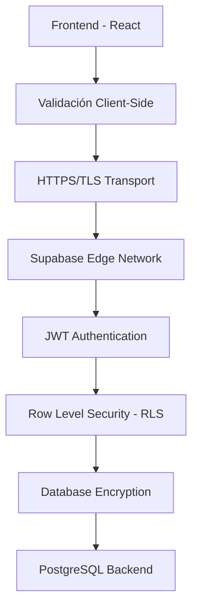

# Seguridad en el Desarrollo
## Proyecto H Chat

### 1. Arquitectura de Seguridad

#### 1.1 Modelo de Seguridad por Capas


#### 1.2 Principios de Seguridad Aplicados
- **Defense in Depth**: Múltiples capas de protección
- **Principle of Least Privilege**: Mínimos permisos necesarios
- **Zero Trust**: Verificación continua de identidad y autorización
- **Secure by Default**: Configuraciones seguras por defecto

### 2. Autenticación y Autorización

#### 2.1 Sistema de Autenticación JWT
**Implementación con Supabase Auth:**
```typescript
// Configuración segura del cliente
export const supabase = createClient<Database>(
  SUPABASE_URL, 
  SUPABASE_PUBLISHABLE_KEY,
  {
    auth: {
      storage: localStorage,        // Almacenamiento seguro
      persistSession: true,        // Sesiones persistentes
      autoRefreshToken: true,      // Renovación automática
      detectSessionInUrl: true     // Detección de sesión en URL
    }
  }
);

// Hook de autenticación segura
export const useAuth = () => {
  const [user, setUser] = useState<User | null>(null);
  const [loading, setLoading] = useState(true);

  useEffect(() => {
    // Obtener sesión actual de forma segura
    const getSession = async () => {
      const { data: { session } } = await supabase.auth.getSession();
      setUser(session?.user ?? null);
      setLoading(false);
    };

    getSession();

    // Escuchar cambios de estado de autenticación
    const { data: { subscription } } = supabase.auth.onAuthStateChange(
      async (event, session) => {
        setUser(session?.user ?? null);
        setLoading(false);
      }
    );

    return () => subscription.unsubscribe();
  }, []);

  return { user, loading };
};
```

#### 2.2 Protección de Rutas
```typescript
// Componente de ruta protegida
export const ProtectedRoute: React.FC<{ children: React.ReactNode }> = ({ 
  children 
}) => {
  const { user, loading } = useAuth();

  if (loading) {
    return <div>Cargando...</div>;
  }

  if (!user) {
    return <Navigate to="/login" replace />;
  }

  return <>{children}</>;
};

// Implementación en router
<Route 
  path="/chat" 
  element={
    <ProtectedRoute>
      <Chat />
    </ProtectedRoute>
  } 
/>
```

#### 2.3 Gestión Segura de Tokens
```typescript
// Interceptor para requests autenticados
const authenticatedRequest = async (url: string, options: RequestInit = {}) => {
  const { data: { session } } = await supabase.auth.getSession();
  
  if (!session?.access_token) {
    throw new Error('No authenticated session');
  }

  return fetch(url, {
    ...options,
    headers: {
      ...options.headers,
      'Authorization': `Bearer ${session.access_token}`,
      'apikey': SUPABASE_PUBLISHABLE_KEY,
    }
  });
};
```

### 3. Row Level Security (RLS)

#### 3.1 Políticas RLS Implementadas
```sql
-- Política para mensajes: usuarios solo ven mensajes públicos
CREATE POLICY "Messages are viewable by authenticated users" 
ON messages FOR SELECT 
USING (auth.role() = 'authenticated');

-- Política para perfiles: usuarios pueden ver perfiles públicos
CREATE POLICY "Profiles are viewable by authenticated users" 
ON profiles FOR SELECT 
USING (auth.role() = 'authenticated');

-- Política para mensajes: usuarios solo pueden crear sus propios mensajes
CREATE POLICY "Users can create own messages" 
ON messages FOR INSERT 
WITH CHECK (auth.uid() = user_id);

-- Política para corazones: usuarios pueden dar corazones pero no duplicados
CREATE POLICY "Users can give hearts" 
ON hearts FOR INSERT 
WITH CHECK (
  auth.uid() = giver_id AND 
  giver_id != receiver_id
);

-- Política para banners de usuario: solo el propietario puede ver sus banners
CREATE POLICY "Users can view own banners" 
ON user_banners FOR SELECT 
USING (auth.uid() = user_id);

-- Política para perfiles: usuarios solo pueden actualizar su propio perfil  
CREATE POLICY "Users can update own profile" 
ON profiles FOR UPDATE 
USING (auth.uid() = user_id);
```

#### 3.2 Funciones de Seguridad en Base de Datos
```sql
-- Función para validar ownership de mensaje antes de eliminar
CREATE OR REPLACE FUNCTION can_delete_message(message_id UUID)
RETURNS BOOLEAN AS $$
BEGIN
  RETURN EXISTS (
    SELECT 1 FROM messages 
    WHERE id = message_id 
    AND user_id = auth.uid()
  );
END;
$$ LANGUAGE plpgsql SECURITY DEFINER;

-- Trigger para actualizar hearts_count de forma segura
CREATE OR REPLACE FUNCTION update_hearts_count()
RETURNS TRIGGER AS $$
BEGIN
  IF TG_OP = 'INSERT' THEN
    UPDATE profiles 
    SET hearts_count = hearts_count + 1
    WHERE user_id = NEW.receiver_id;
    RETURN NEW;
  ELSIF TG_OP = 'DELETE' THEN
    UPDATE profiles 
    SET hearts_count = GREATEST(hearts_count - 1, 0)
    WHERE user_id = OLD.receiver_id;
    RETURN OLD;
  END IF;
  RETURN NULL;
END;
$$ LANGUAGE plpgsql SECURITY DEFINER;
```

### 4. Validación y Sanitización de Datos

#### 4.1 Validación Client-Side
```typescript
// Esquemas de validación con Zod
import { z } from 'zod';

export const messageSchema = z.object({
  content: z.string()
    .min(1, 'El mensaje no puede estar vacío')
    .max(280, 'El mensaje no puede exceder 280 caracteres')
    .refine((content) => content.trim().length > 0, {
      message: 'El mensaje no puede contener solo espacios'
    })
});

export const profileSchema = z.object({
  username: z.string()
    .min(3, 'El nombre de usuario debe tener al menos 3 caracteres')
    .max(20, 'El nombre de usuario no puede exceder 20 caracteres')
    .regex(/^[a-zA-Z0-9_]+$/, 'Solo letras, números y guiones bajos'),
  description: z.string()
    .max(160, 'La descripción no puede exceder 160 caracteres')
    .optional()
});

// Uso en componentes
const MessageInput: React.FC = () => {
  const [content, setContent] = useState('');
  const [errors, setErrors] = useState<string[]>([]);

  const handleSubmit = (e: React.FormEvent) => {
    e.preventDefault();
    
    try {
      const validatedData = messageSchema.parse({ content });
      sendMessage(validatedData.content);
      setContent('');
      setErrors([]);
    } catch (error) {
      if (error instanceof z.ZodError) {
        setErrors(error.errors.map(err => err.message));
      }
    }
  };

  return (
    <form onSubmit={handleSubmit}>
      <input 
        value={content}
        onChange={(e) => setContent(e.target.value)}
        maxLength={280}
      />
      {errors.length > 0 && (
        <div className="error-messages">
          {errors.map(error => <p key={error}>{error}</p>)}
        </div>
      )}
      <button type="submit">Enviar</button>
    </form>
  );
};
```

#### 4.2 Sanitización de Contenido
```typescript
// Función para sanitizar contenido de mensajes
import DOMPurify from 'isomorphic-dompurify';

const sanitizeContent = (content: string): string => {
  // Remover HTML potencialmente peligroso
  const sanitized = DOMPurify.sanitize(content, { 
    ALLOWED_TAGS: [],  // No permitir tags HTML
    ALLOWED_ATTR: []   // No permitir atributos
  });
  
  // Escapar caracteres especiales
  return sanitized
    .replace(/[<>]/g, '') // Remover < y >
    .trim();
};

// Uso en service layer
export const messageService = {
  async createMessage(input: CreateMessageInput): Promise<ServiceResult<void>> {
    try {
      // Validar y sanitizar entrada
      const validation = messageSchema.safeParse(input);
      if (!validation.success) {
        return { success: false, error: 'Datos inválidos' };
      }

      const sanitizedContent = sanitizeContent(validation.data.content);
      
      const { error } = await supabase
        .from('messages')
        .insert({
          content: sanitizedContent,
          user_id: input.userId
        });

      if (error) throw error;
      return { success: true };
    } catch (error: any) {
      return { success: false, error: error.message };
    }
  }
};
```

### 5. Protección contra Vulnerabilidades Comunes

#### 5.1 XSS (Cross-Site Scripting) Prevention
```typescript
// Componente seguro para renderizar contenido de usuario
const SafeContent: React.FC<{ content: string }> = ({ content }) => {
  // React automáticamente escapa contenido en JSX
  // Pero para mayor seguridad, sanitizamos explícitamente
  const safeContent = useMemo(() => {
    return DOMPurify.sanitize(content, {
      ALLOWED_TAGS: ['b', 'i', 'em', 'strong'], // Solo tags básicos
      ALLOWED_ATTR: []
    });
  }, [content]);

  // Usar dangerouslySetInnerHTML solo cuando sea necesario y seguro
  return <span>{content}</span>; // React escapa automáticamente
};

// CSP Headers configurados en Supabase/Hosting
const cspDirectives = {
  'default-src': "'self'",
  'script-src': "'self' 'unsafe-inline'", // Solo para desarrollo
  'style-src': "'self' 'unsafe-inline'",
  'img-src': "'self' data: https:",
  'connect-src': "'self' wss: https:",
  'font-src': "'self'",
  'object-src': "'none'",
  'media-src': "'self'",
  'frame-src': "'none'"
};
```

#### 5.2 CSRF Protection
```typescript
// Supabase maneja CSRF automáticamente con JWT tokens
// Verificación adicional en operaciones críticas
const deleteMessage = async (messageId: string) => {
  // Verificar ownership antes de eliminar
  const { data: message } = await supabase
    .from('messages')
    .select('user_id')
    .eq('id', messageId)
    .single();

  if (!message || message.user_id !== user?.id) {
    throw new Error('No autorizado para eliminar este mensaje');
  }

  // Proceder con eliminación
  const { error } = await supabase
    .from('messages')
    .delete()
    .eq('id', messageId);

  if (error) throw error;
};
```

#### 5.3 SQL Injection Prevention
```typescript
// Supabase PostgREST previene automáticamente SQL injection
// Pero usamos queries parametrizadas para mayor seguridad

// ✅ SEGURO: Query parametrizada
const getUserMessages = async (userId: string) => {
  const { data, error } = await supabase
    .from('messages')
    .select('*')
    .eq('user_id', userId) // Parámetro automáticamente escapado
    .order('created_at', { ascending: false });
  
  return { data, error };
};

// ❌ INSEGURO: Concatenación de strings (evitado)
// const query = `SELECT * FROM messages WHERE user_id = '${userId}'`;
```

### 6. Gestión de Secretos y Variables de Entorno

#### 6.1 Configuración Segura de Variables
```typescript
// Variables de entorno públicas (seguras para el frontend)
const SUPABASE_URL = import.meta.env.VITE_SUPABASE_URL;
const SUPABASE_ANON_KEY = import.meta.env.VITE_SUPABASE_ANON_KEY;

// Validación de variables críticas
if (!SUPABASE_URL || !SUPABASE_ANON_KEY) {
  throw new Error('Missing required environment variables');
}

// Configuración diferenciada por entorno
const config = {
  development: {
    apiUrl: 'http://localhost:3000',
    enableDebug: true
  },
  production: {
    apiUrl: 'https://api.hchat.app',
    enableDebug: false
  }
};
```

#### 6.2 Rotación de Claves
```bash
# Proceso de rotación de claves Supabase
# 1. Generar nueva clave en dashboard de Supabase
# 2. Actualizar variables de entorno
# 3. Desplegar cambios
# 4. Revocar clave anterior después de confirmación
```

### 7. Seguridad en Comunicaciones

#### 7.1 HTTPS/TLS Enforcement
```typescript
// Configuración para forzar HTTPS
const enforceHTTPS = () => {
  if (location.protocol !== 'https:' && location.hostname !== 'localhost') {
    location.replace(`https:${location.href.substring(location.protocol.length)}`);
  }
};

// Verificación de conexión segura para WebSockets
const createSecureConnection = () => {
  const protocol = location.protocol === 'https:' ? 'wss:' : 'ws:';
  return new WebSocket(`${protocol}//${location.host}/realtime`);
};
```

#### 7.2 Configuración CORS Segura
```typescript
// Supabase CORS configurado para dominios específicos
const allowedOrigins = [
  'https://hchat.lovable.app',
  'https://custom-domain.com'
];

// Headers de seguridad configurados
const securityHeaders = {
  'X-Content-Type-Options': 'nosniff',
  'X-Frame-Options': 'DENY',
  'X-XSS-Protection': '1; mode=block',
  'Referrer-Policy': 'strict-origin-when-cross-origin',
  'Permissions-Policy': 'camera=(), microphone=(), geolocation=()'
};
```

### 8. Logging y Monitoreo de Seguridad

#### 8.1 Logging de Eventos de Seguridad
```typescript
// Sistema de logging para eventos críticos
const securityLogger = {
  logFailedLogin: (email: string, ip?: string) => {
    console.warn('Failed login attempt', {
      email,
      ip,
      timestamp: new Date().toISOString(),
      event: 'AUTH_FAILURE'
    });
  },

  logSuspiciousActivity: (userId: string, activity: string) => {
    console.error('Suspicious activity detected', {
      userId,
      activity,
      timestamp: new Date().toISOString(),
      event: 'SECURITY_ALERT'
    });
  },

  logDataAccess: (userId: string, resource: string) => {
    console.info('Data access', {
      userId,
      resource,
      timestamp: new Date().toISOString(),
      event: 'DATA_ACCESS'
    });
  }
};

// Uso en operaciones críticas
const giveHeart = async (giverId: string, receiverId: string) => {
  try {
    // Validaciones de seguridad
    if (giverId === receiverId) {
      securityLogger.logSuspiciousActivity(giverId, 'SELF_HEART_ATTEMPT');
      throw new Error('Cannot give heart to self');
    }

    // Procesar operación
    const result = await heartService.giveHeart({ giverId, receiverId });
    
    if (result.success) {
      securityLogger.logDataAccess(giverId, `HEART_TO_${receiverId}`);
    }
    
    return result;
  } catch (error) {
    securityLogger.logSuspiciousActivity(giverId, `HEART_ERROR: ${error.message}`);
    throw error;
  }
};
```

#### 8.2 Rate Limiting
```typescript
// Rate limiting básico para operaciones sensibles
class RateLimiter {
  private attempts = new Map<string, number[]>();
  
  isAllowed(identifier: string, maxAttempts = 5, windowMs = 60000): boolean {
    const now = Date.now();
    const userAttempts = this.attempts.get(identifier) || [];
    
    // Limpiar intentos antiguos
    const validAttempts = userAttempts.filter(time => now - time < windowMs);
    
    if (validAttempts.length >= maxAttempts) {
      return false;
    }
    
    validAttempts.push(now);
    this.attempts.set(identifier, validAttempts);
    return true;
  }
}

const rateLimiter = new RateLimiter();

// Uso en operaciones críticas
const sendMessage = async (content: string) => {
  const userId = user?.id;
  if (!userId) return;
  
  if (!rateLimiter.isAllowed(`message_${userId}`, 10, 60000)) {
    toast.error('Demasiados mensajes. Espera un momento.');
    return;
  }
  
  // Proceder con envío
};
```

### 9. Auditoría y Compliance

#### 9.1 Trail de Auditoría
```sql
-- Tabla para auditoría de cambios críticos
CREATE TABLE audit_log (
  id UUID PRIMARY KEY DEFAULT gen_random_uuid(),
  user_id UUID REFERENCES auth.users(id),
  action TEXT NOT NULL,
  table_name TEXT NOT NULL,
  record_id UUID,
  old_values JSONB,
  new_values JSONB,
  ip_address INET,
  user_agent TEXT,
  created_at TIMESTAMP WITH TIME ZONE DEFAULT NOW()
);

-- Trigger para auditar cambios en perfiles
CREATE OR REPLACE FUNCTION audit_profile_changes()
RETURNS TRIGGER AS $$
BEGIN
  INSERT INTO audit_log (
    user_id, action, table_name, record_id,
    old_values, new_values
  ) VALUES (
    auth.uid(), TG_OP, TG_TABLE_NAME, COALESCE(NEW.id, OLD.id),
    CASE WHEN TG_OP = 'DELETE' THEN to_jsonb(OLD) ELSE NULL END,
    CASE WHEN TG_OP IN ('INSERT', 'UPDATE') THEN to_jsonb(NEW) ELSE NULL END
  );
  RETURN COALESCE(NEW, OLD);
END;
$$ LANGUAGE plpgsql SECURITY DEFINER;
```

#### 9.2 Cumplimiento de Regulaciones
```typescript
// Implementación básica de GDPR compliance
const gdprCompliance = {
  // Derecho al olvido
  deleteUserData: async (userId: string) => {
    // Anonimizar mensajes en lugar de eliminar para integridad referencial
    await supabase
      .from('messages')
      .update({ content: '[Usuario eliminado]' })
      .eq('user_id', userId);
      
    // Eliminar datos personales
    await supabase
      .from('profiles')
      .delete()
      .eq('user_id', userId);
  },

  // Exportación de datos
  exportUserData: async (userId: string) => {
    const [profile, messages, hearts] = await Promise.all([
      supabase.from('profiles').select('*').eq('user_id', userId),
      supabase.from('messages').select('*').eq('user_id', userId),
      supabase.from('hearts').select('*').eq('giver_id', userId)
    ]);

    return {
      profile: profile.data,
      messages: messages.data,
      hearts_given: hearts.data,
      exported_at: new Date().toISOString()
    };
  }
};
```

### 10. Security Checklist

#### 10.1 Implementaciones Completadas ✅
- [x] Autenticación JWT con Supabase Auth
- [x] Row Level Security (RLS) en todas las tablas
- [x] Validación de entrada client-side y server-side
- [x] Sanitización de contenido de usuario
- [x] Protección HTTPS/TLS
- [x] Gestión segura de secretos
- [x] Rate limiting básico
- [x] Logging de eventos de seguridad
- [x] Políticas de CORS configuradas
- [x] Headers de seguridad implementados

#### 10.2 Medidas Preventivas ✅
- [x] Prevención de XSS mediante sanitización
- [x] Prevención de CSRF con tokens JWT
- [x] Prevención de SQL Injection con queries parametrizadas
- [x] Validación de autorización en operaciones críticas
- [x] Encriptación de datos en tránsito y reposo
- [x] Gestión de sesiones segura
- [x] Verificación de integridad de datos

#### 10.3 Monitoreo y Respuesta ✅
- [x] Logging de intentos de acceso fallidos
- [x] Detección de actividad sospechosa
- [x] Alertas para eventos críticos
- [x] Trail de auditoría para cambios importantes
- [x] Procedimientos de respuesta a incidentes

### Conclusión
La implementación de seguridad en H Chat sigue las mejores prácticas de la industria, proporcionando múltiples capas de protección desde el frontend hasta la base de datos. La combinación de Supabase Auth, RLS, validación rigurosa y monitoreo continuo resulta en una aplicación segura y confiable para los usuarios.